# Tree-Based Rule Creation System

## Overview

This implementation provides a **tree-view driven rule creation system** where users mark intent on tree nodes and the system generates rules on explicit Apply action.

**Supported Rule Types:**
- ✅ **Required Rules** (v1) - Mark fields as required
- ✅ **Array Length Rules** (v2) - Set min/max constraints on arrays
- ✅ **Terminology Rules** (v3) - Constrain code systems and allowed codes

### Core Principle
> **"Users mark intent on data. The system owns correctness and wording."**

## Architecture

### 1. Intent-First Design

Rules are **NEVER** created directly from tree interaction. Instead:

```
Required: Tree Node Checkbox → RuleIntent → Preview → Apply → Backend → Draft Rules
Array Length: Tree Node Inputs (Min/Max) → RuleIntent → Preview → Apply → Backend → Draft Rules
Terminology: Observed Values Selection → RuleIntent → Preview → Apply → Backend → Draft Rules
```

### 2. Key Components

#### State Management
- **`useRuleIntentState.ts`**: Hook managing pending intents
  - Add/remove/clear intents
  - Deduplication by path + type
  - No persistence until Apply

#### UI Components
- **`TreeNodeWithRuleIntent.tsx`**: Enhanced tree node with checkbox and array controls
  - Required checkbox: Shows on hover for eligible nodes (☐ ☑ ✔)
  - Array Length section: Collapsible panel for array nodes (purple badge)
  - Terminology section: Collapsible panel for coding fields (orange badge)
  - No direct rule creation - only intents

- **`ArrayLengthControls.tsx`**: Inline array constraint inputs
  - Min/Max number inputs
  - Non-empty checkbox (string arrays only)
  - Live validation feedback
  - Updates intent on change, removes on clear

- **`ObservedValuesPanel.tsx`**: Terminology constraint UI
  - Shows observed values from sample data
  - System mode: Single-select buttons for code systems
  - Code mode: Multi-select checkboxes for allowed codes
  - Creates CODE_SYSTEM or ALLOWED_CODES intents
  - Shows observation counts and pending indicators

- **`PendingActionBar.tsx`**: Sticky action bar
  - Appears when intents.length > 0
  - Actions: Preview, Apply, Clear
  - Shows pending count
  - Displays validation errors
  - Disables Apply if validation fails

- **`RulePreviewDrawer.tsx`**: Preview drawer
  - Shows what WILL be created (not created yet)
  - Displays: path, type, severity, generated message
  - For Array Length: shows Min/Max/NonEmpty params
  - Messages are READ-ONLY (system-generated)

- **`TreeBasedRuleCreator.tsx`**: Complete integration example
  - Orchestrates all components
  - Handles API calls
  - Manages lifecycle

#### API
- **`rulesApi.ts`**: Backend communication
  - `bulkCreateRules()`: POST /api/rules/bulk
  - Returns created rules with generated messages

#### Types
- **`ruleIntent.ts`**: Type definitions
  - `RuleIntent`: Pending user action (REQUIRED | ARRAY_LENGTH | CODE_SYSTEM | ALLOWED_CODES)
  - `ArrayLengthParams`: Min/max/nonEmpty constraints
  - `CodeSystemParams`: System URI for code system constraint
  - `AllowedCodesParams`: System (optional) and codes array for allowed codes
  - `DraftRule`: Created rule structure
  - `BulkRuleIntentRequest/Response`: API contracts

#### Utilities
- **`ruleIntentValidation.ts`**: Validation logic
  - `validateRuleIntent()`: Validate single intent
  - `validateAllIntents()`: Validate all pending intents
  - Validates array length constraints (min >= 0, max >= min, at least one constraint)
  - Validates terminology constraints (system non-empty, at least one code, no empty codes)
  - Blocks Apply if validation fails

## Integration Guide

### Step 1: Add to Existing Tree Component

In your `FhirSchemaTreeViewWithCoverage.tsx` or similar:

```tsx
import { useRuleIntentState } from '../hooks/useRuleIntentState';
import TreeNodeWithRuleIntent from './rules/TreeNodeWithRuleIntent';
import PendingActionBar from './rules/PendingActionBar';
import RulePreviewDrawer from './rules/RulePreviewDrawer';

// Inside component:
const {
  intents,
  addIntent,
  removeIntent,
  clearIntents,
  hasIntent,
  getIntent,
  count,
} = useRuleIntentState();

const handleToggleIntent = (intent: RuleIntent | null) => {
  if (intent === null) {
    // Remove existing intent (user cleared)
    // Note: TreeNode components handle determining which intent to remove
    return;
  }
  
  // Add or update intent
  addIntent(intent);
};
```

### Step 2: Replace Tree Node Rendering

Replace your existing node rendering with:

```tsx
<TreeNodeWithRuleIntent
  element={element}
  level={level}
  isExpanded={isExpanded}
  isSelected={isSelected}
  onToggle={() => toggleNode(element.path)}
  onSelect={() => handleSelectNode(element)}
  existingRules={existingRules} // Pass from parent
  onToggleIntent={handleToggleIntent}
  hasIntent={hasIntent}
  getIntent={getIntent}
  coverageBadge={/* your existing badge */}
  observedValues={observedValuesForPath[element.path]} // Optional: for terminology
  terminologyFieldType={getFieldType(element.path)} // Optional: 'system' | 'code'
/>
```

### Step 3: Add Validation

```tsx
import { validateAllIntents } from '../utils/ruleIntentValidation';

// Inside component:
const validationResult = validateAllIntents(intents);
```

### Step 4: Add Action Bar and Preview

```tsx
<PendingActionBar
  count={count}
  onPreview={() => setIsPreviewOpen(true)}
  onApply={handleApply}
  onClear={handleClear}
  isApplying={isApplying}
  hasValidationErrors={!validationResult.isValid}
  validationErrors={validationResult.errors}
/>

<RulePreviewDrawer
  isOpen={isPreviewOpen}
  intents={intents}
  onClose={() => setIsPreviewOpen(false)}
/>
```

### Step 5: Implement Apply Logic

```tsx
const handleApply = async () => {
  // Validate before applying
  const validationResult = validateAllIntents(intents);
  if (!validationResult.isValid) {
    alert('Cannot apply: ' + validationResult.errors.join('\n'));
    return;
  }

  setIsApplying(true);
  try {
    const response = await bulkCreateRules(projectId, { intents });
    
    // Update parent state with new rules
    onRulesCreated(response.created);
    
    // Clear intents
    clearIntents();
    
    alert(`Created ${response.created.length} rules`);
  } catch (err) {
    setError(err.message);
  } finally {
    setIsApplying(false);
  }
};
```

## Backend API Contract

### Endpoint: `POST /api/rules/bulk`

**Request:**
```json
{
  "projectId": "abc-123",
  "intents": [
    {
      "type": "REQUIRED",
      "path": "Patient.gender",
      "resourceType": "Patient"
    },
    {
      "type": "ARRAY_LENGTH",
      "path": "Patient.address.line",
      "resourceType": "Patient",
      "params": {
        "min": 1,
        "max": 5,
        "nonEmpty": true
      }
    },
    {
      "type": "CODE_SYSTEM",
      "path": "Observation.code.coding.system",
      "resourceType": "Observation",
      "params": {
        "system": "https://fhir.synapxe.sg/CodeSystem/screening-type"
      }
    },
    {
      "type": "ALLOWED_CODES",
      "path": "Observation.code.coding.code",
      "resourceType": "Observation",
      "params": {
        "system": "https://fhir.synapxe.sg/CodeSystem/screening-type",
        "codes": ["HS", "OS", "VS"]
      }
    }
  ]
}
```

**Response:**
```json
{
  "created": [
    {
      "id": "rule-uuid-1",
      "type": "Required",
      "resourceType": "Patient",
      "path": "Patient.gender",
      "severity": "error",
      "message": "Patient.gender is required.",
      "status": "draft"
    },
    {
      "id": "rule-uuid-2",
      "type": "ArrayLength",
      "resourceType": "Patient",
      "path": "Patient.address.line",
      "severity": "error",
      "message": "Patient.address.line must contain between 1 and 5 items, all items must be non-empty.",
      "status": "draft",
      "params": {
        "min": 1,
        "max": 5,
        "nonEmpty": true
      }
    },
    {
      "id": "rule-uuid-3",
      "type": "CodeSystem",
      "resourceType": "Observation",
      "path": "Observation.code.coding.system",
      "severity": "error",
      "message": "Observation.code.coding.system must use code system: https://fhir.synapxe.sg/CodeSystem/screening-type",
      "status": "draft",
      "params": {
        "system": "https://fhir.synapxe.sg/CodeSystem/screening-type"
      }
    },
    {
      "id": "rule-uuid-4",
      "type": "AllowedCodes",
      "resourceType": "Observation",
      "path": "Observation.code.coding.code",
      "severity": "error",
      "message": "Observation.code.coding.code must be one of: HS, OS, VS",
      "status": "draft",
      "params": {
        "system": "https://fhir.synapxe.sg/CodeSystem/screening-type",
        "codes": ["HS", "OS", "VS"]
      }
    }
  ],
  "errors": []
}
```

### Backend Responsibilities

1. **Message Generation**: System generates error messages via template
   
   **Required Rules:**
   ```
   Template: "{path} is required."
   Example: "Patient.gender is required."
   ```
   
   **Array Length Rules:**
   ```
   Template variants:
   - Min + Max: "{path} must contain between {min} and {max} items."
   - Min only: "{path} must contain at least {min} item(s)."
   - Max only: "{path} must contain at most {max} item(s)."
   - + NonEmpty: "all items must be non-empty"
   
   Example: "Patient.address.line must contain between 1 and 5 items, all items must be non-empty."
   ```
   
   **Code System Rules:**
   ```
   Template: "{path} must use code system: {system}"
   Example: "Observation.code.coding.system must use code system: https://fhir.synapxe.sg/CodeSystem/screening-type"
   ```
   
   **Allowed Codes Rules:**
   ```
   Template: "{path} must be one of: {code1, code2, ...}"
   Example: "Observation.code.coding.code must be one of: HS, OS, VS"
   ```

2. **Status Assignment**: All new rules start as `status: "draft"`

3. **ID Generation**: Assign unique IDs to each rule

4. **Validation**: 
   - Check for duplicates
   - Validate paths
   - Validate array length params (min >= 0, max >= min)
   - Ensure at least one constraint is set
   - Validate code system URI is non-empty
   - Validate allowed codes has at least one code, no empty strings

## UX Behavior Specification

### Required Checkbox States

| State | Visual | Meaning | Clickable |
|-------|--------|---------|-----------|
| Available | ☐ Gray | No rule, no intent | ✓ Yes |
| Pending | ☑ Blue | Intent exists (not applied) | ✓ Yes (to remove) |
| Existing | ✔ Green | Rule already exists | ✗ No (disabled) |

### Array Length Section States

| State | Visual | Meaning |
|-------|--------|---------|
| Collapsed | 🔷 "Array Length" | No intent, no rule |
| Collapsed + Pending | 🔷 "Array Length" 🔵 | Intent exists |
| Collapsed + Existing | 🔷 "Array Length" ✓ | Rule exists |
| Expanded | 🔽 Min/Max inputs + NonEmpty checkbox | User can edit constraints |
| Expanded + Invalid | 🔽 Red validation errors | Invalid constraints (Apply blocked) |

### Terminology Section States

| State | Visual | Meaning |
|-------|--------|---------|
| Collapsed | 🟠 "Terminology" | No intent, no rule, has observed values |
| Collapsed + Pending | 🟠 "Terminology" 🔵 | Intent exists (CODE_SYSTEM or ALLOWED_CODES) |
| Collapsed + Existing | 🟠 "Terminology" ✓ | Rule exists |
| Expanded (System) | 🔽 Observed systems list with buttons | User can select code system |
| Expanded (Code) | 🔽 Observed codes list with checkboxes | User can multi-select allowed codes |

### Eligibility Rules

**Required Checkbox:**
- ✓ Node is NOT root (e.g., not "Patient" itself)
- ✓ Node is NOT derived/system-only (no `_` prefix, not "id", not "extension")
- ✓ No existing Required rule for this path

**Array Length Section:**
- ✓ Node is an array (cardinality contains `*` or max > 1)
- ✓ Node is NOT root
- ✓ Node is NOT derived/system-only
- ✓ No existing ArrayLength rule for this path

**Terminology Section:**
- ✓ Node has observed terminology values (observedValues prop provided)
- ✓ Node is NOT root
- ✓ Node is NOT derived/system-only
- ✓ No existing CodeSystem/AllowedCodes rule for this path
- ✓ Field type is 'system' or 'code' (terminologyFieldType prop)

### Action Flow

```mermaid
graph LR
  A[Checkbox Click] --> B[Add/Remove Intent]
  B --> C[Show Action Bar]
  C --> D[User: Preview]
  D --> E[Review in Drawer]
  E --> F[User: Apply]
  F --> G[API Call]
  G --> H[Backend Creates Rules]
  H --> I[Return Draft Rules]
  I --> J[Update UI]
  J --> K[Clear Intents]
```



## Design Constraints

### ❌ Explicit DO NOTs

1. **DO NOT** create rules on checkbox click or input change
2. **DO NOT** auto-apply rules
3. **DO NOT** allow user to type error messages
4. **DO NOT** mix suggestion logic here
5. **DO NOT** build generic "Add Rule" forms
6. **DO NOT** require FHIRPath input from user
7. **DO NOT** bypass validation before Apply

### ✅ Requirements

1. **DO** use intent-based workflow
2. **DO** generate messages system-side
3. **DO** create rules as Draft status
4. **DO** validate in Preview before Apply
5. **DO** provide bulk creation capability
6. **DO** maintain tree visual state after creation

## Testing Checklist

**Required Rules:**
- [ ] User can select multiple fields with checkboxes
- [ ] Checkbox shows three states (available/pending/existing)
- [ ] Existing Required rules disable checkbox

**Array Length Rules:**
- [ ] Array nodes show "Array Length" section
- [ ] Non-array nodes don't show Array Length section
- [ ] Min/Max inputs update intent live
- [ ] Non-empty checkbox appears for string arrays only
- [ ] Clearing all inputs removes intent
- [ ] Invalid constraints show validation errors
- [ ] Section indicator shows pending state (blue dot)
- [ ] Section indicator shows existing state (check mark)

**General:**
- [ ] Pending count displays correctly
- [ ] Preview shows all intents with generated messages
- [ ] Apply creates rules via API
- [ ] Apply is disabled when validation fails
- [ ] No rule exists until Apply is clicked
- [ ] Rules appear as Draft after creation
- [ ] Tree reflects rule state (badges/indicators)
- [ ] Clear removes all intents
- [ ] Error messages are system-generated
- [ ] Root nodes don't show controls
- [ ] System fields (id, extension) excluded
- [ ] Required and Array Length intents can coexist

## File Structure

```
frontend/src/
├── types/
│   └── ruleIntent.ts                    # Core types (RuleIntent, ArrayLengthParams, DraftRule)
├── hooks/
│   └── useRuleIntentState.ts            # State management (add/remove/clear/has/get)
├── api/
│   └── rulesApi.ts                       # Backend communication (bulkCreateRules)
├── utils/
│   └── ruleIntentValidation.ts          # Validation logic (validateRuleIntent, validateAllIntents)
└── components/
    └── rules/
        ├── TreeNodeWithRuleIntent.tsx    # Enhanced node with checkbox + array section
        ├── ArrayLengthControls.tsx       # Min/Max inputs + NonEmpty checkbox
        ├── PendingActionBar.tsx          # Action bar with validation errors
        ├── RulePreviewDrawer.tsx         # Preview UI with params display
        └── TreeBasedRuleCreator.tsx      # Integration example
```

## Array Length Validation Rules

The system validates Array Length intents before allowing Apply:

1. **At least one constraint** must be set (min, max, or nonEmpty)
2. **Min must be >= 0** (if set)
3. **Max must be >= 0** (if set)
4. **Max must be >= Min** (if both set)

Invalid intents:
- Show inline errors in ArrayLengthControls
- Display in PendingActionBar validation section
- Block Apply button

## Next Steps

1. **Backend Implementation**
   - Implement `POST /api/rules/bulk` endpoint
   - Add message template engine for both Required and Array Length
   - Handle params validation (min/max/nonEmpty)
   - Handle duplicate detection
   - Return draft rules with params

2. **Frontend Integration**
   - Integrate into existing tree component
   - Update getIntent call signatures
   - Connect to project rule state
   - Add error handling
   - Test with real data

3. **Future Enhancements** (v3)
   - Additional rule types (Allowed Values, Pattern, Reference, etc.)
   - Bulk edit mode
   - Rule templates
   - Advanced filtering
   - Rule versioning

## Support

For questions or issues, refer to the architecture specs:
- `/docs/03_rule_dsl_spec.md`
- `/docs/06_frontend_requirements.md`
